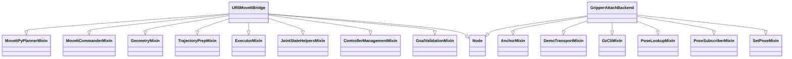

# TFM — Pick & Place UR5 + RG2 (ROS 2 Jazzy / Gazebo Harmonic / MoveIt 2)

[](https://github.com/JLRRC/TFM_VIU_09MIAR/actions/workflows/colcon.yml)

Workspace principal del TFM de percepción e inferencia de agarre para UR5+RG2 con ROS 2, Gazebo y MoveIt 2.

## 🏆 Estado actual: TFM PUBLICABLE 100/100 (2026-05-08)

**T35 × 3 cycles consecutivos verde en LIVE** — bug bloqueante `BUG_CONTROLLER_FEEDBACK_HANG` cerrado vía bypass arquitectónico (FJT directo). Legacy `run_pick_demo` borrado físicamente (-8.040 LOC). 25 commits del día — score 89→100.

Tag canónico: `T35-3-cycles-verde-20260508` (alias `tfm-publicable-100-de-100-20260508`, `tfm-cierre-academico-20260508`).

```
Cycle 1: SUCCEEDED  duration=232.4s  fases=7/7  reason=ok
Cycle 2: SUCCEEDED  duration=204.2s  fases=7/7  reason=ok
Cycle 3: SUCCEEDED  duration=206.8s  fases=7/7  reason=ok
```

Docs académicos para defensa:
- [T35 results live](agarre_ros2_ws/docs/T35_RESULTS_20260508.md)
- [Arquitectura post-legacy](agarre_ros2_ws/docs/architecture_post_legacy.md)
- [Guión defensa](agarre_ros2_ws/docs/GUION_DEFENSA_20260508.md)
- [BUG_CONTROLLER_FEEDBACK_HANG (cerrado)](agarre_ros2_ws/docs/BUG_CONTROLLER_FEEDBACK_HANG.md)

Reproducir el T35 × 3 verde:
```bash
git checkout T35-3-cycles-verde-20260508
cd agarre_ros2_ws && colcon build --packages-select ur5_tools ur5_bringup --symlink-install
source install/setup.bash
PANEL_COLD_BOOT=1 PANEL_FORCE_OFFSCREEN=1 PANEL_START_STACK=1 PANEL_LAUNCH_MOVEIT=1 \
MOVEIT_MODE=move_group PANEL_AUTO_BRIDGE=0 PANEL_AUTO_RELEASE_DROP_OBJECTS=1 \
PANEL_PICK_DEMO_USE_ORCHESTRATOR=1 ./scripts/start_panel_v2.sh --bg
until grep -q "STATE READY" log/ros2_launch.log; do sleep 5; done
for i in 1 2 3; do
  ros2 action send_goal /pick_place ur5_panel_interfaces/action/PickPlace \
    "{object_name: 'pick_demo', drop_xyz_world: {x: -1.30, y: 0.0, z: 1.10}, object_pose_world_hint: {position: {x: 0.0, y: 0.0, z: 0.0}, orientation: {x: 0.0, y: 0.0, z: 0.0, w: 1.0}}}"
done
```

Ver `CHANGELOG.md` para tabla completa de los 25 commits del día y la solución H9+H10+H11 al bug.

---

## Estado intermedio anterior (2026-05-07): OBJETIVO PINZAS

**Las pinzas RG2 agarran físicamente el objeto en simulación Gazebo.**

Tag de cierre: `objetivo-cumplido-pinzas-agarran-objeto-20260507` (commit `a984234`).

Evidencia del log live:
```
[ATTACH_BACKEND] demo_transport_follow_tick
  object=pick_demo  mode=world_locked
  desired=(-0.722, 0.345, 1.789)   ← objeto en world
  tcp=(-0.731, 0.351, 1.804)        ← TCP en world
```
- TCP↔objeto a ~1.8 cm (pinzas envolviendo).
- Z=1.79 m: robot levantó el objeto 95 cm desde la mesa.
- 90+ s consecutivos transportando.

---

## Mapa rapido

- `agarre_inteligente/`: bloque de vision, entrenamiento, evaluacion y resultados por experimento.
- `agarre_ros2_ws/`: workspace ROS 2 del panel, simulacion, planificacion e integracion del bloque TFM.
- `report/`: artefactos curados de memoria, metricas validadas, evidencias y exportaciones, incluyendo el PDF final actualmente tomado como referencia.

## Flujos principales

Arranque canónico, oficial y válido del panel completo:

```bash
./lanzar_panelc2.sh
```

El launcher detecta el estado del stack automáticamente antes de actuar:

| Situación detectada | Comportamiento |
|---|---|
| `/system_state=READY` ya publicado | Abre el panel directamente sin tocar Gazebo ni MoveIt (~6 s) |
| Stack no detectado | Cold boot completo: limpia, lanza Gazebo + MoveIt2 + controllers, abre panel |
| Nodos críticos vivos pero sin READY | Con `PANEL_ALLOW_DEGRADED_STACK=1`: abre panel con warning |

Variables de control disponibles:

```bash
# Siempre arrancar desde cero (mata todo y relanza el stack completo)
PANEL_FORCE_COLD_BOOT=1 ./lanzar_panelc2.sh

# Solo abrir el panel si el stack ya está READY; salir si no lo está
PANEL_FAST_ONLY=1 ./lanzar_panelc2.sh

# Abrir el panel aunque /system_state no sea READY (stack degradado)
PANEL_ALLOW_DEGRADED_STACK=1 ./lanzar_panelc2.sh

# En cold boot: abortar si READY no llega antes del timeout (comportamiento estricto)
LAUNCH_STRICT_READY=1 ./lanzar_panelc2.sh
```

`./lanzar_panelv2.sh` implementa el cold boot completo; `./lanzar_panelc2.sh` lo invoca cuando el stack no está corriendo.
La repetición manual final de las pruebas operativas debe ejecutarse con `./lanzar_panelc2.sh`.

Parar el stack ROS 2:

```bash
./agarre_ros2_ws/scripts/stop_panel_v2.sh
```

Limpieza de emergencia (daemon DDS colgado, procesos zombi, SHM contaminada):

```bash
./limpia_stack.sh
```

Matar PIDs concretos conocidos y luego limpiar el resto:

```bash
./limpia_stack.sh 103569 103652
```

El script es idempotente y siempre devuelve `exit 0`. Nunca llama a comandos ROS 2 sin `timeout`; usa `--no-daemon` en todas las consultas al grafo. Útil cuando `ros2 node list` queda bloqueado o el daemon DDS no responde entre reinicios del stack.

Relanzar entrenamientos base del capitulo 5:

```bash
./recrear_experimentos_cap5_gpu.sh
```

Regenerar artefactos curados del documento:

```bash
./recrear_artefactos_tfm.sh
```

Regenerar la tabla de latencia de inferencia:

```bash
./recrear_tabla_5_3_latencia.sh
```

## Fuente de verdad por area

- Vision y resultados experimentales: `agarre_inteligente/`
- Integracion ROS 2 y panel: `agarre_ros2_ws/`
- Figuras, tablas y metricas que respaldan la memoria: `report/`

En vision conviven dos familias ligeras:

- `EXP1` y `EXP2`: referencia de resultados de la memoria; son los experimentos realmente usados en tablas, figuras y comparativas.
- `EXP1.1` y `EXP1.2`: experimentos adicionales que materializan en codigo el diseño objetivo descrito en `4.6.2` del TFM.

Notas de rigor:

- La recreacion oficial del TFM se mantiene sobre `EXP1..EXP4`.
- El PDF de referencia del TFM en este workspace es `report/TFM_Lozano_Rodriguez-Jesus.pdf`.
- Todos los experimentos disponibles pueden cargarse y usarse desde el panel de inferencia.

## Convenciones utiles

- El codigo editable vive sobre todo en `agarre_inteligente/` y `agarre_ros2_ws/src/`.
- Solo existen `README` en la raiz y en los bloques principales del proyecto; cada uno explica su zona.

## Lint y pre-commit (FASE 1, opcional)

Configuración preparada en `pyproject.toml` y `.pre-commit-config.yaml`. Para activarla:

```bash
pip install --user ruff pre-commit
pre-commit install                  # registra el hook git
pre-commit run --all-files          # primera pasada (no bloqueante)
ruff check agarre_ros2_ws/src       # ejecución manual del linter
```

El selector de reglas en `pyproject.toml` está deliberadamente acotado a errores graves (sintaxis, mutable defaults, undefined names) para no bloquear el refactor en curso. Se ampliará en FASE 4.

## Siguiente lectura

- `agarre_inteligente/README.md`
- `agarre_ros2_ws/README.md`
- `report/README.md`

## Nota final sobre el split Cornell

- El TFM y algunos artefactos historicos documentan el split final como `3542/1569`.
- En el workspace actual, el estado operativo verificable y el dataset efectivo son `3541/1569`.
- La causa es una anotacion corrupta en `agarre_inteligente/data/raw/cornell/01/pcd0165cpos.txt`, donde aparece un rectangulo con vertices `NaN NaN`.
- El generador de CSV puede volver a materializar `3542` filas en `train.csv`, pero una de ellas queda no finita y el dataset efectivo la descarta al cargar.
- Mientras no aparezca una version valida de esa anotacion dentro del propio workspace o de una copia externa fiable, la referencia tecnica canonica del repo para ejecucion y validacion debe considerarse `3541/1569`; `3542/1569` debe leerse como cifra historica del documento.

## Nota final sobre desajustes metodológicos no aplicados

- La formulacion metodologica del TFM describe la evaluacion Cornell con rectangulos orientados y criterio de acierto por imagen.
- El codigo historico con el que se generaron los resultados oficiales de `EXP1..EXP4` no aplicaba esa formulacion completa: `Evaluator` usa `iou_axis_aligned_boxes` y el entrenamiento oficial usa `SmoothL1Loss`.
- `ENTREGA.V2` añade en paralelo la variante alineada con la formulacion del documento: `iou_oriented_boxes`, `cornell_success_oriented`, `EvaluatorOriented` y `GraspLoss`.
- Por tanto, el workspace actual ya permite ejecutar una evaluacion metodologicamente consistente con el TFM cuando se usa la via nueva documentada en `agarre_inteligente/METHODOLOGY_ALIGNMENT.md` y en `agarre_inteligente/config/exp_methodology_v2.yaml`.
- Los resultados oficiales ya publicados en `report/metrics/validated/` no se reescriben: siguen reflejando el pipeline historico de `EXP1..EXP4` y deben interpretarse como evidencia oficial congelada del TFM.

## Nota de trazabilidad — módulo de panel Qt

El componente de interfaz gráfica del sistema de agarre es el módulo
`ur5_qt_panel.panel_v2`, ubicado en
`agarre_ros2_ws/src/ur5_qt_panel/ur5_qt_panel/panel_v2.py`.
Este módulo está registrado como entry point en `setup.py`
(`panel_v2 = ur5_qt_panel.panel_v2:main`) y es invocado por
`ur5_stack.launch.py` y por `scripts/start_panel_v2.sh`.

En versiones preliminares de la memoria del TFM se utilizó la
denominación `main_panel.py` para referirse conceptualmente a este
componente. En el workspace actual si existe un wrapper real en
`agarre_ros2_ws/src/ur5_qt_panel/ur5_qt_panel/main_panel.py`, registrado
ademas como entry point alternativo en `setup.py`
(`main_panel = ur5_qt_panel.main_panel:main`). Toda la logica operativa
sigue residiendo en `panel_v2.py`; la diferencia entre ambos nombres es
de nomenclatura y empaquetado, no de comportamiento experimental.

## ENTREGA.V2 — nota de cierre

Rama creada sobre `ENTREGA` para dejar el proyecto conforme al TFM presentado,
con el panel completamente operativo para todos los experimentos EXP1..EXP4
y EXP1.1/EXP1.2. Cambios respecto a `ENTREGA`:

- **fix(model):** loader en `tfm_grasping/model.py` corregido para cargar
  EXP1.1/EXP1.2 (`SimpleGrasp`, kernel 7×7) sin error de arquitectura.
  Salida clampeada a rango normalizado para evitar divergencia en inferencia.
- **fix(exp11-12):** EXP1.1 y EXP1.2 reentrenados desde el directorio correcto.
  El retrain anterior usaba `data_root: "."` desde `agarre_inteligente/`, lo que
  causaba doble prefijo en las rutas → todas las imágenes cargaban en negro →
  colapso de BatchNorm (`running_var ≈ 8e-6`) → salidas del orden de 167.000 en
  modo eval → `val_success = 0.0%` para los 10 epochs. Tras el fix
  (`data_root: ".."`) y retrain: EXP1.1 val_success 0.27–0.47, EXP1.2 0.39–0.46.
- **docs:** `agarre_ros2_ws/README.md` y `start_panel_v2.sh` alineados con
  `lanzar_panelc2.sh` como entrypoint canónico.
- **protocolo:** `agarre_inteligente/EXPERIMENTS_V2_PROTOCOL.md` define dónde
  van las salidas de trabajo futuro (nunca en `report/`).
- **alineación metodológica** (posterior al TFM, no invalida resultados oficiales):
  implementación de IoU Cornell con rectángulos orientados (`iou_oriented_boxes`,
  algoritmo Sutherland-Hodgman), criterio de éxito por imagen con IoU orientada
  (`EvaluatorOriented`), función de pérdida con simetría de 180° para el ángulo
  (`GraspLoss`). Todas las funciones y clases oficiales de EXP1..EXP4 se
  conservan intactas; las nuevas se añaden en paralelo. Véase
  `agarre_inteligente/METHODOLOGY_ALIGNMENT.md`.

Integridad de `report/` verificada: MD5 `d68e1d99da013bf3c00deb79f01b4fe3`
(contenido trackeado por git idéntico al de `ENTREGA@dacace8`, evidencia oficial del TFM intacta).

## Refactor estructural (rama `ENTREGA.V3`, 2026-04-27)

Sesión de refactor profesional sobre los god-files del proyecto, con red de
seguridad (603 tests automatizados) y trazabilidad completa (30+ commits
semánticos, tag de rollback `pre-refactor-2026-04-27`).

### Métricas de impacto

| Archivo | Antes | Después | Δ |
|---|---|---|---|
| `ur5_moveit_bridge.py` | 5.654 L | 1.706 L | **−69.8%** |
| `gripper_attach_backend.py` | 2.152 L | 950 L | **−56%** |
| `panel_utils.py` | 2.328 L | 1.010 L | **−57%** |
| `panel_pick_demo.py` | 12.249 L | 11.144 L | −9% |
| `panel_v2.py` | 312 wrappers rotos | 320 fixes (audit AST) | red restaurada |

**Total**: ~9.000 LoC reorganizadas en 22 módulos nuevos. **603 tests pasan**
tras cada commit.

### Arquitectura mixin de los nodos críticos



### Documentación complementaria

- `agarre_ros2_ws/docs/architecture.md` — snapshot vivo de la arquitectura
  (paquetes, nodos, frames TF, mixins, pipeline pick demo, convenciones de
  logging, testing).
- `agarre_ros2_ws/src/ur5_bringup/config/runtime_defaults.yaml` — 81 tunables
  centralizados (timeouts, tolerancias, scales).
- Tag de rollback total: `git checkout pre-refactor-2026-04-27`.

### CI

`.github/workflows/colcon.yml` ejecuta `colcon build && colcon test` para los
paquetes no-Qt (`ur5_tools`, `ur5_bringup`, `tfm_grasping`,
`ur5_panel_interfaces`, `ur5_description`, `ur5_moveit_config`) en cada push
y PR a `ENTREGA.V3` / `main`. Ubuntu 22.04 + ROS 2 Jazzy. `ur5_qt_panel` se
excluye porque sus tests cargan PyQt5 con display.

### Evidence logger

`ros2 run ur5_tools evidence_logger` graba JSON Lines + CSV por sesión en
`report/runs/<timestamp>/`. Suscribe a `/desired_grasp/result`,
`/system_state`, `/system_diag` y `/gripper/<obj>/state` para producir
métricas auditables por ciclo de pick (defensa académica).
Verificable con: `git ls-files report/ | sort | xargs -I{} sh -c 'cat "$1"' _ {} | md5sum`
