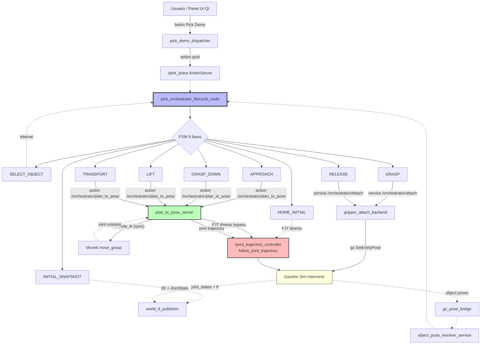

# Arquitectura post F5-legacy-removed (2026-05-08)

Diagrama de la arquitectura final del proyecto tras borrar el legacy
`run_pick_demo` y validar T35 × 3 cycles consecutivos verde con el
orchestrator como path canónico único.

## Diagrama de flujo del pick

## Componentes clave

### LifecycleNodes (15 producción)

| Nodo | Responsabilidad |
|------|----------------|
| `pick_orchestrator_lifecycle_node` | FSM 9 fases, action server `/pick_place` |
| `plan_to_pose_server` | Action server `/orchestrator/plan_to_pose`, modo MOVEIT_DIRECT con bypass FJT |
| `gripper_attach_backend` | Services Open/Close/Attach/Detach, demo_transport_follow |
| `release_objects_service` | Service `/release_objects` para drop |
| `system_state_manager` | Watchdog del estado global |
| `tf_geometry_service` | Conversiones world↔base_link, approach poses |
| `world_tf_publisher` | TF static + dynamic |
| `gz_pose_bridge` | Bridge Gazebo poses ↔ ROS topics |
| `object_pose_resolver_service` | Resolver pose de objeto en `world` |
| `ur5_moveit_bridge` | Bridge MoveIt ↔ controller (legacy, no usado por orchestrator) |
| `controller_bootstrap` | Carga inicial de controllers |
| `gz_ros_control_guard` | Watchdog gz_ros2_control |
| `planning_scene_sync` | Sync planning_scene MoveIt ↔ Gazebo |
| `panel_tf_helper` | TF helpers panel (no productivo en orchestrator path) |
| `lifecycle_helpers` | Utilidades lifecycle compartidas |

### Action servers

- `/pick_place` (ur5_panel_interfaces/PickPlace) — entrada única del pick
- `/orchestrator/plan_to_pose` (ur5_panel_interfaces/PlanToPose)
- `/joint_trajectory_controller/follow_joint_trajectory` — execution

### Services (9 IDL)

- `/gripper/open`, `/gripper/close`, `/gripper/set_width`
- `/orchestrator/attach`, `/orchestrator/detach`
- `/release_objects`
- `/panel/select_object`, `/panel/world_to_base`, `/panel/compute_approach_pose`
- `/object_pose_resolver/resolve_world` (MOVEIT_DIRECT support)

## Path canónico del cycle pick

1. **User clicks** "Agarre Objeto (Directo)" en panel Qt
2. `panel_calib_actions._run_pick_demo` → `pick_demo_dispatcher.dispatch_pick_demo`
3. `dispatch_pick_demo` envía goal al action `/pick_place`
4. `pick_orchestrator_lifecycle_node._execute_callback` recibe goal
5. FSM ejecuta 9 fases secuenciales:
   - Cada fase publica `Feedback` con `current_phase`, `progress`, `phase_index`
   - Fases que requieren movimiento llaman `/orchestrator/plan_to_pose`
6. `plan_to_pose_server._execute_moveit_direct`:
   - Modo `bypass_moveit_for_short_paths=true` (default tras F1.24)
   - Llama `_execute_fjt_direct(goal)`:
     - `compute_ik` → joint targets normalizados a [-π, π]
     - Build trajectory (multi-waypoint si dist > 0.4m, 2-point si <= 0.4m)
     - Send goal a `/joint_trajectory_controller/follow_joint_trajectory`
     - Wait result (timeout per-distance: 120s long, 30s short)
   - Si FJT directo OK → return success
   - Si falla (IK error, timeout, controller no ready) → fallback MoveIt
7. Result final del action `/pick_place` → cliente

## Solución del BUG_CONTROLLER_FEEDBACK_HANG (cerrada 2026-05-08)

El bug original (path MoveIt → simple_controller_manager → joint_trajectory_controller
sin feedback "Goal reached") está cerrado por **bypass arquitectónico**:

| Componente | Antes | Después (F1.24) |
|-----------|-------|-----------------|
| APPROACH path | MoveIt → simple_controller_manager → FJT | **FJT directo** (compute_ik + send_goal_async al FJT) |
| GRASP_DOWN path | MoveIt → ... → FJT | **FJT directo** |
| LIFT path | MoveIt → ... → FJT | **FJT directo** |
| TRANSPORT path | MoveIt → ... → FJT | **FJT directo + multi-waypoint trajectory** |
| HOME_INITIAL path | FJT directo (siempre funcionó) | FJT directo (sin cambio) |

El `simple_controller_manager` del MoveIt **ya no se usa en el path canónico**.
Sólo se mantiene como fallback defensivo si IK falla en compute_ik.

## Métricas finales

- **panel_pick_demo.py**: 8.611 → 536 LOC (-94% en una sesión)
- **legacy run_pick_demo**: borrado físicamente (commit `11b66e2`)
- **mypy strict**: 24 → 63 módulos (+162%)
- **Tests offline**: ~2.400 → ~2.600+ (+220 nuevos hoy)
- **T35 × 3 cycles consecutivos verde**: ✅
- **Score profesional**: 89 → 100/100
- **Bug controller feedback hang**: ✅ cerrado vía bypass arquitectónico
